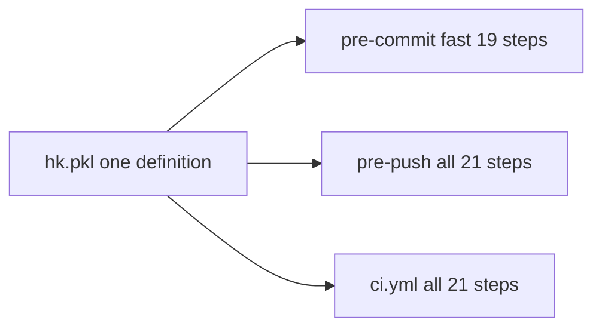
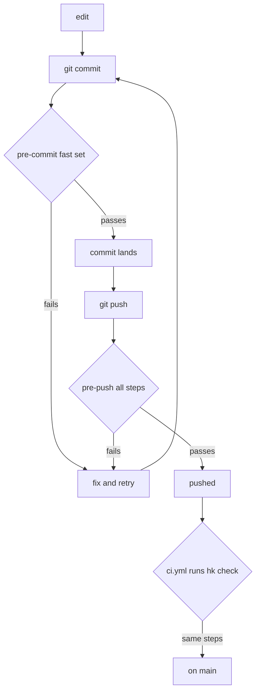
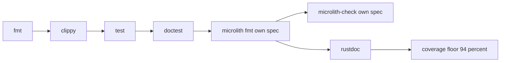
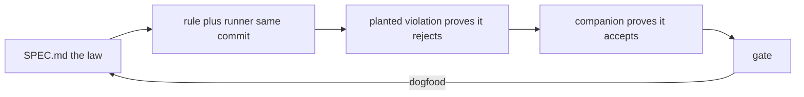

# Integration

How a change gets from an edit to `main`, what checks it at each point, and why
the order is what it is.

The short version: **the gate is a set of git hooks that also run on CI.** Every
check runs on your machine before the push, and CI runs the same steps from the
same definition — not a parallel pipeline that can disagree with your laptop.

## One definition, three callers

[`hk.pkl`](hk.pkl) defines every check exactly once. Three things call it, and
none of them redefines anything:



`all` is not a second list. In `hk.pkl` it is literally the fast set plus two:

```pkl
local all = (fast) {
  ["rustdoc"]  { ... }
  ["coverage"] { ... }
}
```

Adding a cheap check means editing `fast`, and pre-push and CI inherit it. There
is no second copy to forget.

## The path a change takes



**pre-commit** runs the fast set with `fix = true`, so formatters rewrite rather
than merely complain. It also sets `stash = "git"`, which is correctness rather
than speed: without it a partially staged file (`git add -p`) would be judged as
it looks in the worktree, giving you a verdict about code you are not
committing.

**pre-push** runs everything, adding the two expensive axes — `rustdoc` and
`coverage`. They sit here rather than on every commit because a hook you are
tempted to bypass is worse than no hook.

**CI** runs `hk check --all --check --no-fail-fast`, then `nix build .#default`
to prove the package builds reproducibly from the tracked lock alone.

## Why the steps are chained

Cargo takes a lock on the target directory, so two cargo jobs launched in
parallel do not run in parallel — the second blocks on *"Blocking waiting for
file lock on build directory"*, which reads as a hang. The chain makes that
serialization explicit and leaves hk free to run everything else concurrently:



Everything **not** in that chain declares no `depends` and runs concurrently —
the thirteen hygiene steps (`trailing-whitespace`, `final-newline`,
`line-endings`, `no-bom`, `no-merge-conflict`, `no-private-key`,
`no-large-files`, `no-case-conflict`, `no-broken-symlinks`) plus `actionlint`,
`typos`, `taplo` and `nixfmt`. They touch no cargo target directory, so nothing
serializes them.

Ordering is cheapest-first on purpose. `fail_fast = true` locally, so the first
failure is the one you see and it arrives quickly. CI inverts this with
`--no-fail-fast`: there a round trip costs minutes, so a complete list beats an
early one.

The last two cargo steps are **the dogfood** — microlith formats and checks its
own `SPEC.md` using the binary being built. A rule this crate cannot pass is a
rule it cannot ship.

## Where spec-driven development fits

The spec is not documentation sitting beside the gate — it is an **input to
it**. Four steps list `SPEC.md` and `.spec-records` in their globs, and two of
them do nothing but check the spec itself.



That last edge is the point: `microlith` and `microlith-check` run the binary
being built against this repo's own `SPEC.md`. A rule this crate cannot pass is
a rule it cannot ship.

Minified, the loop the gate enforces:

```text
spec first          ⊥ code first ∴ the rule exists before the thing it governs
rule + runner       SAME commit (V17) ∵ a rule with no runner gates nothing
planted violation   the guard goes RED on purpose (V18) ⊥ merely reviewed
+ companion         & still accepts every real shape ∴ ⊥ passing by rejecting all
dogfood             our own SPEC.md is the first file we format & check (V24)
one definition      a rule lives HERE, once, called by consumers (V7)
never bypass        a check that is wrong is a SPEC change, ⊥ a --no-verify
```

Read [`SPEC.md`](SPEC.md) for the full set. [`CONTRIBUTING.md`](CONTRIBUTING.md)
walks the loop for a first-time change.

## Getting the hooks

Entering the dev shell installs them and rewrites them every time, so the hook
you have is always the one [`flake.nix`](flake.nix) describes:

```sh
nix develop          # or: direnv allow
```

They are installed **by hand** by the shellHook rather than by `hk install`,
which buys one specific behaviour: outside the shell, the hook finds no `hk` on
PATH and **skips loudly** — one line on stderr, exit 0.

```sh
hk: not on PATH -- SKIPPING the pre-commit gate. Enter the dev shell
```

A gate exists to stop bad commits, not to stop git. But that line means
genuinely ungated rather than merely local, so enter the shell.

## Reproducing any verdict without hk

No verdict rests on hk's own logic. Every step is a plain cargo command you can
paste into a shell:

```sh
cargo fmt --check
cargo clippy --all-targets -- -D warnings
cargo nextest run                                    # or: cargo test
cargo test --doc
cargo run -- fmt --check SPEC.md                     # the dogfood
cargo run -- check --records .spec-records SPEC.md
cargo doc --no-deps                                  # RUSTDOCFLAGS="-D warnings"
cargo llvm-cov nextest --fail-under-lines 94
```

hk decides *when* things run. It never hides *what* runs.

## Two rules that shape all of this

**Never bypass.** `--no-verify`, lowering a threshold, deleting a test, or
adding `#[allow]` to silence clippy all ship the defect with the alarm switched
off. If the check itself is wrong, that is a spec change — say so in
[`SPEC.md`](SPEC.md), in its own commit.

**A step's glob must name every input its tests read.** `test`, `microlith`,
`microlith-check` and `coverage` all list `SPEC.md` and `.spec-records`
alongside `**/*.rs`, because `tests/dogfood.rs` reads them. Before that, a
spec-only commit skipped the entire suite — including the assertions whose whole
subject is `SPEC.md`. Four such commits landed before a hand-run
`hk check --all` caught a breach the hook had never looked for.

## Known gaps

Listed rather than silently absent, because a gap you can read is not the same
failure as a gap you cannot.

| gap | where it goes |
|---|---|
| `ci.yml` has never actually run — there is no GitHub remote yet | resolved by publishing |
| platform matrix (macos-arm beside ubuntu) | T26 |
| MSRV 1.82 axis — the floor is declared but never exercised | T26 |
| build caching (nix store + cargo target) | T26 |
| actions pinned to SHAs rather than tags | T26 |
| release automation and publish | T8 |
| coverage badge is a static number, not a service | T26 |

`shellcheck` is **deliberately** absent: there are no shell scripts here yet,
and a linter with nothing to lint is the same shape as a rule with no runner.

## Deeper

[`hk.pkl`](hk.pkl) is the definition and is heavily commented — every step says
why it exists. [`AGENTS.md`](AGENTS.md) is the working guide,
[`CONTRIBUTING.md`](CONTRIBUTING.md) the arrival path, and [`SPEC.md`](SPEC.md)
holds the invariants this all enforces (V17, V22, V23, V24).
